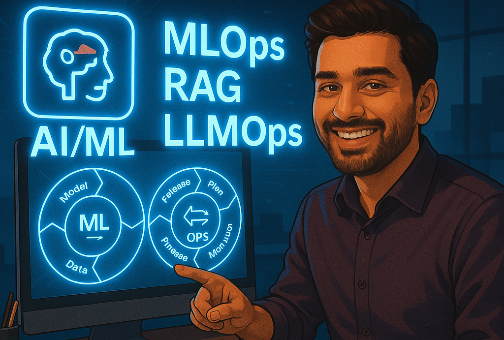

## Hi there 👋, I'm Anand Puthiyapurayil!

### 👨‍💻 About Me
I'm an experienced **Big Data and Machine Learning Engineer** passionate about creating scalable and impactful AI-driven solutions. My expertise spans from designing and industrializing end-to-end MLOps pipelines to managing comprehensive data science workflows.

I thrive on turning data into actionable insights, optimizing workflows, integrating innovative AI solutions into real-world applications, and making **Enterprise AI a reality**.

---

### 🚀 Professional Journey

**🔹 Jr Data Scientist @ Business Gateways International Pvt. Ltd.** *(Nov 2024 – Present)*  
- Leading AI integration initiatives and designing scalable AI systems.
- Developing generative AI-driven recommendation systems and search engines.
- Streamlining ML operations through robust MLOps workflows (CI/CD, monitoring, version control).

**🔹 Big Data & ML Engineer @ SAP** *(Oct 2022 – Mar 2023)*  
- Developed Azure-based Data Lake solutions (Databricks, Spark, MLflow).
- Created automated monitoring solutions for artifacts 
- Developed an efficient MLops Framework with CI/CD in within Databricks for the end users
- Implemented a Feature Store, enhancing ML production efficiency by 15%.

**🔹 Data Scientist Intern @ Rubixe Information Technology & Services** *(Mar 2020 – Jul 2020)*  
- Built data pipelines and anomaly detection models.
- Enhanced prediction accuracy by 20% using statistical and heuristic approaches.

---

### 🎓 Education
- **MSc in Artificial Intelligence Systems**, EPITA School of Engineering, Paris, France (2021-2023)
- **Bachelors in Computer Science**, Ponnaiyah Ramajayam Institute of Science & Technology, India (2014-2018)

---

### 🛠️ Technical Skills
- **Languages:** Python, SQL
- **Big Data & Cloud:** Spark, Databricks, Azure, SAP Cloud Platform
- **MLOps & CI/CD:** MLflow, Jenkins, Airflow, JIRA 
- **Frameworks & Tools:** FastAPI, Streamlit, Grafana, Plotly, Git , Langchain 
- **ML Libraries:** NumPy, Pandas, Scikit-learn, TensorFlow, Keras, OpenCV, SHAP, Matplotlib, Huggingface

---

### 🌟 Featured Projects
- **AI Powered Search Engine:** Deployed an efficient Hybrid Search Engine and RAG based Product Summary system .
- **MLOps Framework & Feature Store:** Deployed efficient ML workflows from prototyping to production.
- **Continual Learning for Facial Recognition:** Implemented drift detection, adaptive modeling, and Bayesian inference.
- **Model Explainability Pipeline:** Leveraged SHAP and MLflow for transparent ML model deployment.

---
### 🤝 Let's Connect
- 📧 [anand.nelliot@gmail.com](mailto:anand.nelliot@gmail.com)
- 💼 [LinkedIn](https://www.linkedin.com/in/anand-p-/)

Feel free to reach out for collaboration, mentoring, or just a friendly chat about AI and Data Science!

✨ Keep Exploring, Keep Learning! ✨
